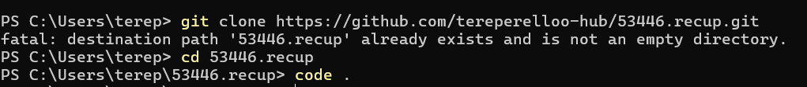
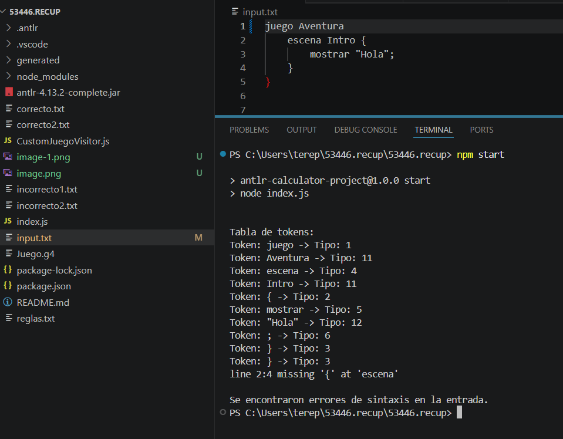
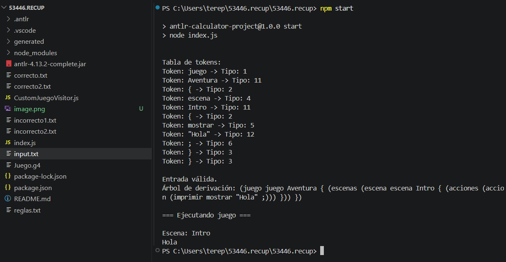

# Analizador de lenguaje de juego con ANTLR4

Descripción

Este proyecto implementa un analizador léxico, sintáctico e intérprete para un lenguaje de definición de juegos, utilizando ANTLR4 y JavaScript.

El lenguaje permite definir juegos con escenas y acciones como mostrar mensajes.

# Requisitos

Para poder ejecutar correctamente el analizador, es necesario contar con:

·Node.js instalado (versión 14 o superior recomendada)
·npm (incluido con Node.js)
·Sistema operativo: Windows, Linux o MacOS
·Tener instalada la herramienta Git (opcional, para clonar el repositorio)
·Conocimientos básicos sobre archivos JSON (ya que el proyecto puede generar o utilizar este formato para representar datos)

# Instalación
1. Clonar el repositorio en una carpeta:
git clone https://github.com/tereperelloo-hub/53446.recup.git

2. Luego nos tenemos que dirigir al directorio lo cual escribimos:
cd 53446.recup

3. Abrimos VS Code para trabajar con el proyecto, para ello colocamos:
code .

Se veria algo asi desde la powershell

En caso de haber descargado el proyecto como archivo ZIP, puede generarse una carpeta adicional (por ejemplo 53446.recup-main). En ese caso, asegurarse de ingresar a la carpeta donde se encuentra el archivo package.json.

# Ejecución del analizador

Instalar las dependencias necesarias:  npm install

Ejecutar el programa:  npm start

# Importante: 

·Tiene que verse algo asi, en este caso a mi no se me duplicaron las carpetas, pero si sucede recuerde ingresar primero con 

cd 53446.recup-main

Y luego: 
npm start 

·Si al ejecutar npm install o npm start aparece un error, verificar que:

-Estás ubicado en la carpeta correcta
-Existe el archivo package.json

Podés comprobarlo con:

dir

Si ves package.json, entonces estás en el lugar correcto.

# Uso del proyecto

1. Una vez configurado el proyecto, podemos ejecutar el analizador de la siguiente forma:

2. Elegir un ejemplo

Dentro del proyecto se incluyen ejemplos de prueba:

correcto.txt
correcto2.txt
incorrecto1.txt
incorrecto2.txt

Para probarlos, copiar el contenido de alguno de estos archivos dentro de input.txt y luego ejecutar el programa.

En este caso elegí el ejemplo correcto. Deberia verse algo como: 

# Funcionalidades

- Análisis léxico (tabla de tokens)
- Análisis sintáctico
- Detección de errores
- Generación de árbol de derivación
- Interpretación del lenguaje (visitor)

